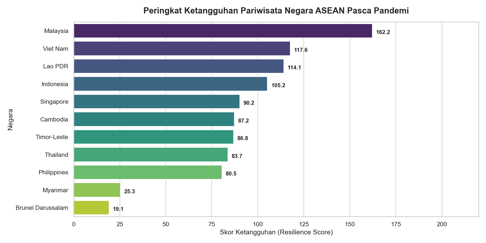
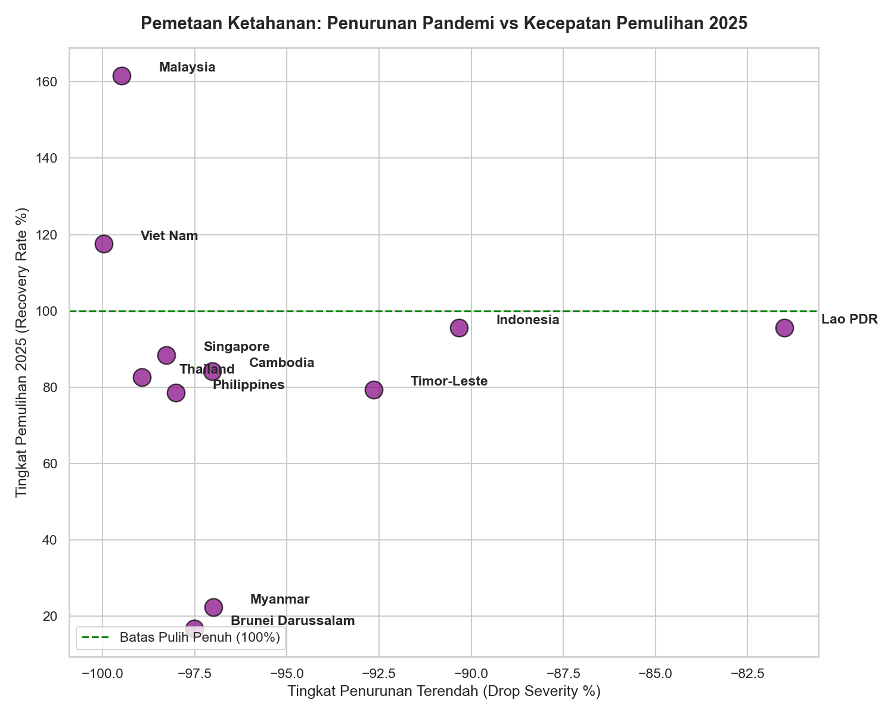
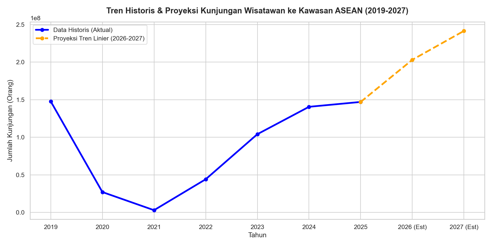

# ASEAN Tourism Recovery & Economic Resilience Tracker (2019-2027)

[English](#english) | [Bahasa Indonesia](#bahasa-indonesia)

---

## 🇬🇧 English Version

### 📌 Executive Summary (30-Second Read)
* **Objective**: Analyzed the impact of COVID-19 and the recovery paths of the tourism sector across **11 ASEAN countries**, measuring resilience indices and projecting tourist arrivals up to **2027**.
* **Key Findings**:
  - **The Crisis Peak**: During the 2020-2021 crisis, international arrivals collapsed to just **2% of 2019 baseline levels** region-wide.
  - **Resilience Leader**: **Malaysia** leads regional resilience with a composite score of **162.19**, achieving a **161.67% recovery rate** by 2025 (fully recovered by 2024). **Vietnam** follows in 2nd with a **117.55% recovery rate** (score: 117.56).
  - **Partial Recovery**: **Indonesia** (95.53% recovery, score: 105.20) and **Singapore** (88.47% recovery, score: 90.20) have shown strong, steady recovery but remain slightly below pre-pandemic normal capacity.
  - **Lagging Markets**: **Myanmar** (22.30% recovery, score: 25.30) and **Brunei** (16.66% recovery, score: 19.14) are classified as highly vulnerable due to extremely slow recovery.
  - **Composite Forecast (2026-2027)**: Total ASEAN arrivals are projected to reach **203M in 2026** and **241M in 2027**—a **+64.26% growth** compared to 2025, driven by visa relaxations and airline route restorations.
* **Actionable Recommendations**:
  - **Benchmark Top Performers**: Adopt successful tourism policies from Malaysia and Vietnam, such as extensive visa-free entry programs and aggressive international marketing campaigns.
  - **Focussed Policy Intervention**: Direct resources and cross-border infrastructure initiatives toward lagging markets (e.g. Myanmar and Brunei) to restore connectivity and regional attractiveness.
  - **Quarterly Monitoring**: Implement quarterly tracking of tourism KPIs against these projection models to dynamically optimize airline route frequencies and marketing budgets.

---

### 📊 Resilience Ranking Table

Here is the sector resilience index calculated for the 11 ASEAN member nations:

| Rank | Country | Lowest Arrivals (Crisis) | Drop Severity (%) | Recovery Rate 2025 (%) | Recovery Status (Year Recovered) | Composite Resilience Score |
|:---:|---|:---:|:---:|:---:|:---:|:---:|
| 1 | **Malaysia** | 134,728 | -99.48% | **161.67%** | Fully Recovered (2024) | **162.19** (Highly Resilient) |
| 2 | **Viet Nam** | 3,500 | -99.98% | **117.55%** | Fully Recovered (2025) | **117.56** (Highly Resilient) |
| 3 | **Lao PDR** | 886,447 | **-81.50%** | 95.61% | Partially Recovered | **114.11** (Resilient) |
| 4 | **Indonesia** | 1,557,530 | **-90.33%** | 95.53% | Partially Recovered | **105.20** (Resilient) |
| 5 | **Singapore** | 330,059 | -98.27% | 88.47% | Partially Recovered | **90.20** (Moderate) |
| 6 | **Cambodia** | 196,495 | -97.03% | 84.25% | Fully Recovered (2024) | **87.23** (Moderate) |
| 7 | **Timor-Leste** | 3,718 | -92.65% | 79.41% | Fully Recovered (2023) | **86.75** (Moderate) |
| 8 | **Thailand** | 427,869 | -98.93% | 82.61% | Partially Recovered | **83.68** (Moderate) |
| 9 | **Philippines** | 163,879 | -98.02% | 78.49% | Partially Recovered | **80.47** (Moderate) |
| 10 | **Myanmar** | 130,947 | -97.00% | 22.30% | Partially Recovered | **25.30** (Vulnerable) |
| 11 | **Brunei Darussalam** | 110,391 | -97.52% | 16.66% | Partially Recovered | **19.14** (Vulnerable) |

---

### 📊 Key Visualizations

#### 1. Sector Resilience Index Ranking
The bar chart ranks the composite resilience of each country. Malaysia ranks first due to its fast post-pandemic growth exceeding pre-crisis levels. Lao PDR and Indonesia score high on resilience because they successfully defended a larger share of their tourist volume during the pandemic's peak.

#### 2. Quadrant Analysis: Drop Severity vs. Recovery Rate
This maps the initial pandemic drop (X-axis) against the recovery percentage in 2025 (Y-axis). Countries positioned above the 100% horizontal line have successfully restructured and grown beyond their pre-pandemic market capacity.

#### 3. ASEAN Composite Arrivals Projection (2026-2027)
Modeled using OLS linear regression of the recovery years (2021-2025), the total regional arrivals are projected to reach **203 million in 2026** and **241 million in 2027**, indicating a complete structural recovery for the region.

---

## 🇮🇩 Versi Bahasa Indonesia

### 📌 Ringkasan Eksekutif (30 Detik Baca)
* **Tujuan**: Menganalisis dampak pandemi COVID-19 dan jalur pemulihan sektor pariwisata di **11 negara ASEAN**, mengukur indeks ketahanan sektoral, serta memproyeksikan kunjungan wisatawan hingga tahun **2027**.
* **Temuan Utama**:
  - **Titik Terendah Krisis**: Pada puncak pandemi (2020-2021), kunjungan wisatawan mancanegara anjlok hingga menyisakan hanya **2% dari kondisi normal 2019** di seluruh kawasan.
  - **Pemimpin Resiliensi**: **Malaysia** memimpin ketangguhan regional dengan skor komposit **162,19**, mencapai tingkat pemulihan sebesar **161,67%** pada tahun 2025 (pulih penuh sejak 2024). **Vietnam** menyusul di peringkat kedua dengan tingkat pemulihan **117,55%** (skor: 117,56).
  - **Pemulihan Sebagian**: **Indonesia** (pemulihan 95,53%, skor: 105,20) dan **Singapura** (pemulihan 88,47%, skor: 90,20) menunjukkan tren pemulihan yang kuat namun masih sedikit di bawah kapasitas normal sebelum pandemi.
  - **Pasar yang Rentan**: **Myanmar** (pemulihan 22,30%, skor: 25,30) dan **Brunei** (pemulihan 16,66%, skor: 19,14) dikategorikan sangat rentan karena pemulihan yang lambat.
  - **Proyeksi Kawasan (2026-2027)**: Total kunjungan ke ASEAN diproyeksikan mencapai **203 juta pada 2026** dan **241 juta pada 2027**—menunjukkan pertumbuhan sebesar **+64,26%** dibanding tahun 2025.
* **Rekomendasi Bisnis**:
  - **Benchmark Kebijakan Terbaik**: Adopsi kebijakan sukses dari Malaysia dan Vietnam, seperti pelonggaran visa kunjungan dan kampanye pemasaran internasional yang agresif.
  - **Intervensi Kebijakan Terarah**: Fokuskan alokasi sumber daya dan konektivitas rute udara ke negara-negara yang lambat pulih (Brunei dan Myanmar) untuk memulihkan daya tarik regional secara menyeluruh.
  - **Evaluasi KPI Berkala**: Lakukan pelacakan KPI kunjungan setiap kuartal berdasarkan model proyeksi ini untuk mengoptimalkan frekuensi rute penerbangan dan anggaran promosi pariwisata.

---

### 📊 Tabel Peringkat Ketahanan Sektor

Berikut adalah peringkat ketahanan sektor pariwisata hasil analisis data pariwisata ASEAN:

| Peringkat | Negara | Kunjungan Terendah (Krisis) | Drop Severity (%) | Recovery Rate 2025 (%) | Status Pemulihan (Tahun Pulih) | Skor Ketangguhan (Resilience Score) |
|:---:|---|:---:|:---:|:---:|:---:|:---:|
| 1 | **Malaysia** | 134.728 | -99.48% | **161.67%** | Pulih Penuh (2024) | **162.19** (Sangat Tangguh) |
| 2 | **Viet Nam** | 3.500 | -99.98% | **117.55%** | Pulih Penuh (2025) | **117.56** (Sangat Tangguh) |
| 3 | **Lao PDR** | 886.447 | **-81.50%** | 95.61% | Belum Pulih Penuh | **114.11** (Tangguh) |
| 4 | **Indonesia** | 1.557.530 | **-90.33%** | 95.53% | Belum Pulih Penuh | **105.20** (Tangguh) |
| 5 | **Singapore** | 330.059 | -98.27% | 88.47% | Belum Pulih Penuh | **90.20** (Moderat) |
| 6 | **Cambodia** | 196.495 | -97.03% | 84.25% | Pulih Penuh (2024) | **87.23** (Moderat) |
| 7 | **Timor-Leste** | 3.718 | -92.65% | 79.41% | Pulih Penuh (2023) | **86.75** (Moderat) |
| 8 | **Thailand** | 427.869 | -98.93% | 82.61% | Belum Pulih Penuh | **83.68** (Moderat) |
| 9 | **Philippines** | 163.879 | -98.02% | 78.49% | Belum Pulih Penuh | **80.47** (Moderat) |
| 10 | **Myanmar** | 130.947 | -97.00% | 22.30% | Belum Pulih Penuh | **25.30** (Rentan) |
| 11 | **Brunei Darussalam** | 110.391 | -97.52% | 16.66% | Belum Pulih Penuh | **19.14** (Rentan) |

---

### 📊 Visualisasi Utama

#### 1. Perbandingan Indeks Ketangguhan Sektoral
Malaysia berada di posisi teratas berkat pertumbuhan pasca-pandemi yang melampaui kondisi normal awal. Lao PDR dan Indonesia dinilai tangguh karena mampu mempertahankan sisa pariwisata yang lebih besar selama puncak krisis.

#### 2. Analisis Kuadran: Keparahan vs. Kecepatan Pemulihan
Memetakan keparahan drop saat krisis (Sumbu X) vs. tingkat pemulihan 2025 (Sumbu Y). Negara di atas garis 100% berhasil merekonstruksi industrinya melampaui kapasitas awal.

#### 3. Proyeksi Akumulatif Kunjungan ASEAN (2026-2027)
Menggunakan model Regresi Linear OLS, total kunjungan ke kawasan ASEAN diproyeksikan tumbuh pesat hingga mencapai **203 juta kunjungan pada 2026** dan **241 juta pada 2027**, menunjukkan pertumbuhan **+64,26%** dibanding realisasi tahun 2025.

---

## ⚙️ Teknologi yang Digunakan
* **Python 3.11** (Pandas, NumPy, Scikit-learn, Statsmodels)
* **HTML5 / CSS3 / JavaScript** (Dashboard interaktif dengan tema Sennep Editorial Warmth)
* **Jupyter Notebook** (Untuk data processing pipeline)
* **Git** (Version control)
