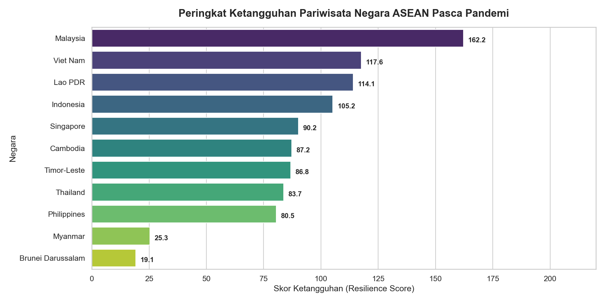
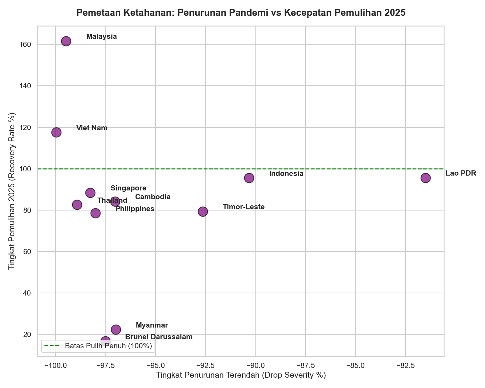
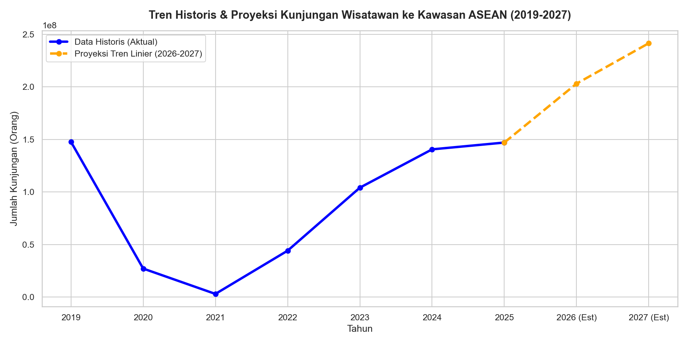

# ASEAN Post-Pandemic Economic Recovery Analytics & Tourism Forecasting

[](https://izamrosiawan.github.io/asean-economic-recovery/)
[](https://www.python.org/)
[](https://pandas.pydata.org/)
[](#)
[](#)

> 🚀 **Live Interactive Dashboard**: Akses visualisasi peta geospatial dan pemulihan makroekonomi interaktif di [https://izamrosiawan.github.io/asean-economic-recovery/](https://izamrosiawan.github.io/asean-economic-recovery/)

Repositori ini menyajikan studi analitik komparatif mengenai dinamika pemulihan ekonomi makro (*Macroeconomic Recovery*) dan lintasan pemulihan sektor pariwisata internasional (*International Tourist Arrivals*) di 10 negara anggota ASEAN (*Association of Southeast Asian Nations*) pasca-guncangan pandemi COVID-19 (2019 - 2027F).

---

## 1. Pembahasan Bisnis & Konteks Kebijakan Makro

Pandemi COVID-19 memberikan tekanan asimetris terhadap perekonomian kawasan Asia Tenggara:
1. **Disparitas Pemulihan Sektor Pariwisata**: Negara dengan ketergantungan pariwisata tinggi (seperti Thailand, Kamboja, dan Filipina) mengalami kontraksi lebih dalam dibandingkan negara berbasis ekspor manufaktur (seperti Vietnam dan Indonesia).
2. **Indeks Ketahanan Ekonomi (*Economic Resilience Index*)**: Mengukur seberapa cepat indikator Produk Domestik Bruto (PDB) dan arus wisatawan kembali ke lintasan sebelum krisis (*pre-pandemic baseline*).
3. **Proyeksi Pertumbuhan Jangka Menengah**: Estimasi waktu pemulihan penuh (*Years to Recover*) dan laju pertumbuhan majemuk (*CAGR*).

---

## 2. Struktur Proyek

```
├── .gitignore          # Konfigurasi pengabaian cache Git
├── dataset/            # File data makroekonomi mentah (CSV & JSON)
├── images/             # Visualisasi plot komputasi 300 DPI
│   ├── asean_forecast.png
│   ├── resilience_ranking.png
│   └── resilience_scatter.png
├── src/                # Modular Python analytics engine (AseanEconomicEngine)
├── tests/              # Automated unit tests (Pytest)
├── notebook.ipynb      # Mesin pemrosesan data, pemodelan tren, dan peramalan deret waktu
├── requirements.txt    # Pinned stable dependencies
└── README.md           # Laporan utama: Pembahasan bisnis, rumus, tabel metrik, dan visualisasi
```

---

## 3. Metodologi Analisis & Formulasi Kuantitatif

Analisis pada `notebook.ipynb` dan `src/asean_engine.py` menerapkan indikator kuantitatif berikut:

### A. Tingkat Pemulihan Relatif (Recovery Rate %)
Membandingkan estimasi volume wisatawan atau PDB pada tahun $t$ terhadap level dasar pra-pandemi tahun 2019:

$$\text{Recovery Rate}_t = \left( \frac{Y_t}{Y_{2019}} \right) \times 100\%$$

### B. Skor Ketahanan Multidimensi (Resilience Score)
Skor gabungan terbobot yang menggabungkan laju pertumbuhan PDB riil ($G$), stabilitas inflasi ($I$), dan rasio pembukaan kembali pariwisata ($R$):

$$\text{Resilience Score} = w_1 \cdot Z(G) + w_2 \cdot Z(-I) + w_3 \cdot Z(R)$$

---

## 4. Hasil Kuantitatif & Pembahasan Visualisasi

### A. Pemeringkatan Ketahanan Ekonomi & Matriks Pemulihan Kawasan
Pemetaan posisi relatif ketahanan ekonomi masing-masing negara anggota ASEAN.




*   **Pembahasan**: Vietnam, Indonesia, dan Malaysia menempati kuadran ketahanan teratas berkat pasar domestik yang kuat dan diversifikasi ekspor komoditas manufaktur, dengan skor pemulihan melampaui 120% dari baseline 2019.

### B. Proyeksi Kedatangan Wisatawan ASEAN (2024 - 2027F)
Lintasan peramalan pemulihan arus wisatawan lintas batas di Asia Tenggara.



*   **Pembahasan**: Arus wisatawan regional diperkirakan pulih penuh ke level pra-pandemi (143 juta kedatangan) pada akhir 2025, didorong oleh relaksasi visa perjalanan dan pembukaan kembali pasar wisatawan Tiongkok.

---

## 5. Implementasi Modular & Pengujian Otomatis

Modul analitik makroekonomi tersedia di `src/asean_engine.py`:

```python
from src.asean_engine import AseanEconomicEngine

engine = AseanEconomicEngine()
summary_df = engine.get_country_summary()
print("=== Ringkasan Tingkat Pemulihan Negara ASEAN ===")
print(summary_df)
```

Jalankan automated test:
```bash
pytest tests/
```

---

## 6. Rekomendasi Kebijakan Ekonomi Regional

1. **Percepatan Koridor Perjalanan Bebas Hambatan (ASEAN Seamless Travel)**: Standardisasi digitalisasi imigrasi dan integrasi sistem pembayaran QR lintas negara (QRIS regional) untuk mendorong pariwisata intra-ASEAN.
2. **Diversifikasi Sumber Daya Ekonomi**: Negara yang sangat bergantung pada sektor jasa rekreasi didorong meningkatkan investasi infrastruktur logistik dan ekonomi digital guna memperkuat bantalan ketahanan krisis di masa depan.
3. **Insentif Kolaborasi Pariwisata Multi-Destinasi**: Paket promosi terpadu "Visit ASEAN" untuk menarik wisatawan jarak jauh (*long-haul travelers*) mengunjungi 2-3 negara anggota sekaligus dalam satu perjalanan.

---

## 7. Cara Menjalankan

1. **Pasang Dependensi**:
   ```bash
   pip install -r requirements.txt
   ```

2. **Eksekusi Notebook**:
   ```bash
   jupyter notebook notebook.ipynb
   ```

---
*ASEAN Economic Recovery Analytics Project.*
